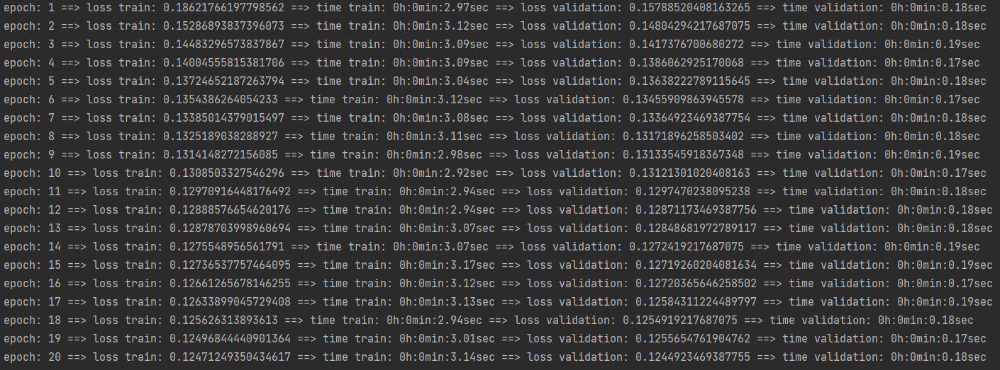
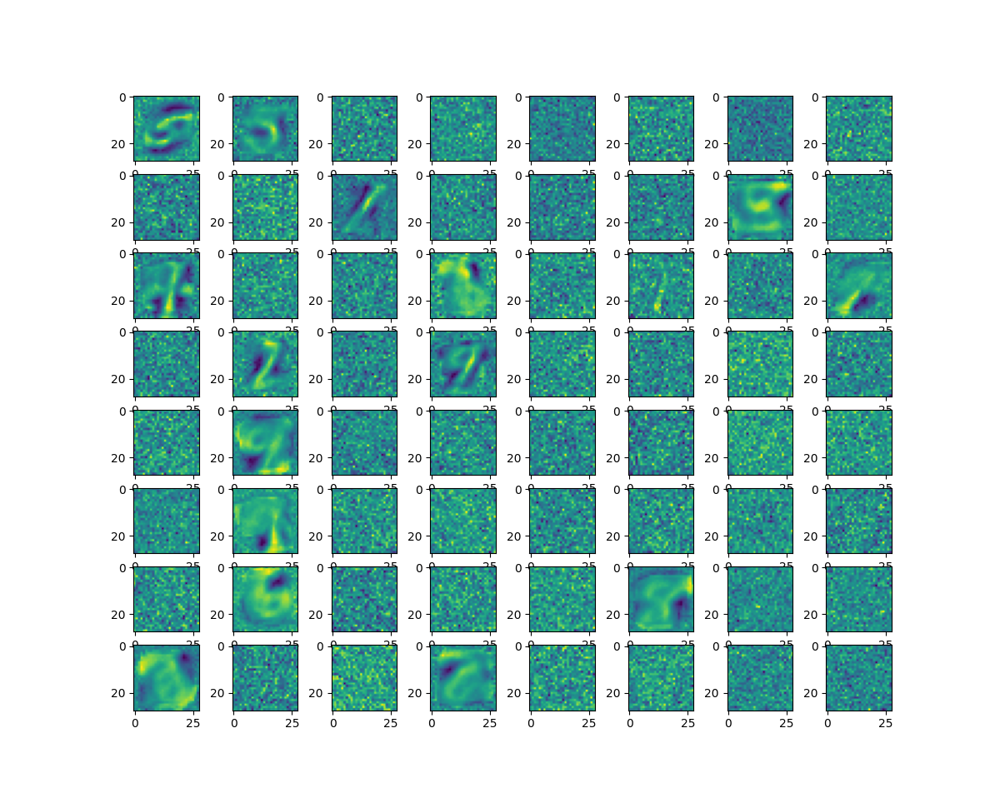

# Restricted Boltzmann Machine
This repository is an implementation of Restricted Boltzmann Machine in Pytorch and Tensorflow.

#### RBM Structure


## Getting started

### Requirements
- python 3.9
- Tensorflow == 2.11.0
- torch == 1.13.1
- pandas == 1.5.3
- numpy == 1.24.2
- mlxtend == 0.21.0
- sklearn == 1.1.1
- matplotlib == 3.6.3

### Usage
```python
from RBM import RBM

rbm = RBM(nv=len(training_set[0]), nh=64, k=5, lr=0.01)
rbm.fit(training_set, batch_size=128, epoch=40, verbose=1, validation_data=validation_set)
predicted = rbm.predict(test_set, verbose=1)

```
#### RunTime reports


### Visualize loss curves

```python
import pandas as pd
pd.DataFrame(rbm.total_losses).plot()
```

#### Loss curves for minist dataset reconstruction using RBM


### Visualize reconstructed images
```python
import matplotlib.pyplot as plt

plt.figure(figsize=(12, 12))
for i in range(1, 33):
    plt.subplot(8, 8, i * 2 - 1)
    plt.imshow(predicted[i].reshape(28, 28))
    plt.subplot(8, 8, i * 2)
    plt.imshow(test_set[i].reshape(28, 28))

plt.show()
```

#### Reconstruction example of minist dataset


### Visualize weights
```python
import matplotlib.pyplot as plt

# visualize tensorflow weights
plt.figure(figsize=(12, 12))
for i in range(1, 65):
    plt.subplot(8, 8, i)
    plt.imshow(rbm.W[i-1].numpy().reshape(28, 28))
    
# visualize torch weights
plt.figure(figsize=(12, 12))
for i in range(1, 65):
    plt.subplot(8, 8, i)
    plt.imshow(rbm.W[i-1].reshape(28, 28))

plt.show()
```

#### Example weights for minist dataset 


## Citation
Please cite this paper if you use this code in your research project.

```
@article{
  title={An introduction to restricted Boltzmann machines.},
  author={A Fischer, C Igel},
  journal={Progress in Pattern Recognition, Image Analysis, Computer Vision, and Applications: 17th Iberoamerican Congress, CIARP 2012, Buenos Aires, Argentina, September 3-6, 2012. Proceedings 17},
  pages={14-36},
  year={2012},
  publisher={Springer}
}
```
